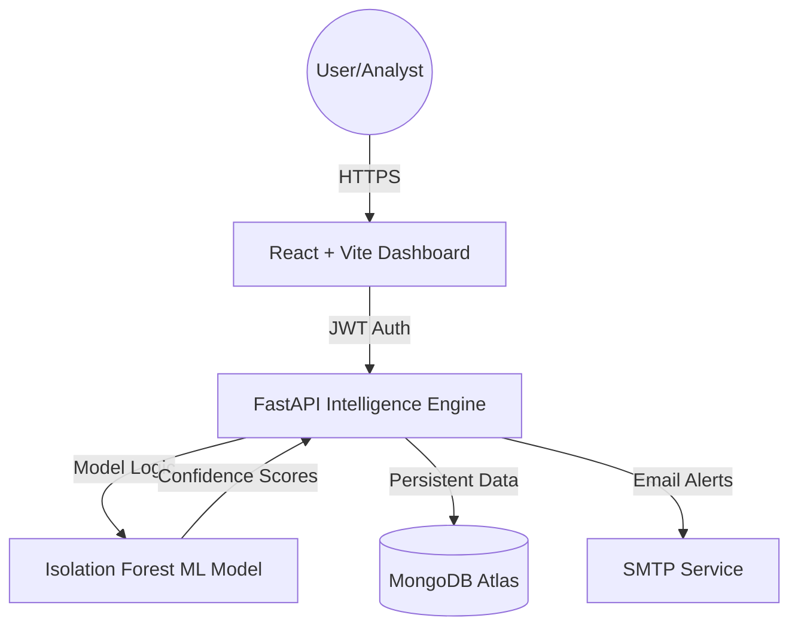

<div align="center">


# THREXIA
### AI-Powered Insider Threat Intelligence & Security Operations Center
*Detecting anomalous behavior before it becomes a breach.*

[**Live Production Deployment**](https://threxia.vercel.app/)

[](https://www.python.org/)
[](https://fastapi.tiangolo.com/)
[](https://www.mongodb.com/atlas)
[](https://react.dev/)
[](https://vercel.com/)

</div>

---

## 📌 Table of Contents

- [🔍 Overview](#-overview)
- [✨ Core Features](#-core-features)
- [🏗️ System Architecture](#-system-architecture)
- [🛠️ Tech Stack](#-tech-stack)
- [🤖 Machine Learning Core](#-machine-learning-core)
- [🔐 Administrative Workflow](#-administrative-workflow)
- [📁 Project Structure](#-project-structure)
- [⚙️ Configuration](#-configuration)
- [🚀 Getting Started](#-getting-started)
- [🌐 Deployment](#-deployment)
- [👨‍💻 Team](#-team)

---

## 🔍 Overview

**THREXIA** is an end-to-end AI-powered threat intelligence platform built to detect insider threats and anomalous user behavior within organizational system logs. It combines unsupervised machine learning (Isolation Forest) with a high-fidelity, role-based security dashboard.

Unlike traditional rule-based systems, THREXIA uses behavioral analytics to identify subtle deviations in operator activity—such as off-hours data access, unusual device usage, or increased document printing—flagging them as potential security risks before data exfiltration occurs.

---

## ✨ Core Features

| Feature | Description |
|---|---|
| 🛡️ **AI-Driven Detection** | Uses Isolation Forest ML models to flag anomalies with high confidence. |
| 📊 **Executive Intelligence** | Automated reporting with neutralization rates, integrity scores, and peak threat hours. |
| 🕵️ **Analyst Command Center** | Real-time telemetry feed for analysts to investigate, resolve, or escalate threats. |
| 💾 **Persistent Logging** | Integrated with **MongoDB Atlas** for secure storage of telemetry and audit data. |
| 🔐 **RBAC & Approval System** | Tiered access levels (Analyst, Manager, Admin) with a multi-stage registration flow. |
| 📧 **SMTP Notifications** | Automated email alerts for access requests, approvals, and security resets. |
| 🎨 **Futuristic UI** | Glassmorphic, responsive interface built for modern Security Operation Centers (SOC). |

---

## 🏗️ System Architecture



---

## 🔐 Administrative Workflow

THREXIA implements a secure ingestion protocol for all platform operators:

1.  **Access Request**: New users submit a registration request with a justification (Reason for Access).
2.  **Pending State**: Accounts are created in a `pending` state with zero platform access.
3.  **Admin Clearance**: A System Administrator receives an email notification and reviews the request in the **Access Control** module.
4.  **Verification**: Upon approval, the user receives a secure temporary passcode via email to initiate their first session.

---

## 🛠️ Tech Stack

### Backend & AI
- **FastAPI**: High-performance Python web framework.
- **Scikit-Learn**: Powering the Isolation Forest anomaly detection.
- **Joblib**: For serialized ML model serving.
- **MongoDB Atlas**: Cloud-native document storage.

### Frontend
- **React 19**: Modern component-based architecture.
- **Vite**: Next-generation frontend tooling.
- **Framer Motion**: Smooth, high-performance UI animations.
- **Lucide React**: Professional security iconography.

---

## 🤖 Machine Learning Core

THREXIA utilizes an **Isolation Forest** algorithm trained on the *Corporate Insider Threat Dataset*. 

- **Input Dimensions**: 14 features (e.g., `printed_off_hours`, `usb_transfer`, `hostility_index`).
- **Inference**: The model calculates an anomaly score for every system log.
- **Explainability**: The system interprets model outputs into human-readable warnings (e.g., *"Abnormal off-hours data extraction detected"*).

---

## 📁 Project Structure

```bash
THREXIA/
├── backend/                # FastAPI Application
│   ├── models/             # Serialized ML Models (.joblib)
│   ├── database.py         # MongoDB Connection & Logic
│   ├── email_service.py    # SMTP Notification Engine
│   └── main.py             # API Routes & Logic
├── frontend/               # React + Vite Application
│   ├── src/
│   │   ├── components/     # Reusable UI Modules
│   │   ├── pages/          # Dashboard & Auth Views
│   │   └── apiConfig.js    # Global API Configuration
├── machine_learning/       # Research & Model Training
│   ├── model.ipynb         # Training Notebook
│   └── extracted_model.py  # Model Logic Extraction
└── requirements.txt        # Backend Dependencies
```

---

## ⚙️ Configuration

To run THREXIA, configure the following environment variables in `backend/.env`:

| Variable | Description |
|---|---|
| `MONGO_URI` | MongoDB Atlas Connection String |
| `MONGO_DB_NAME` | Database Name (default: `Cluster0`) |
| `SECRET_KEY` | JWT Signing Secret |
| `SMTP_USER` | Gmail Address for notifications |
| `SMTP_PASSWORD` | Gmail App Password |
| `ADMIN_EMAIL` | Target email for admin alerts |
| `FRONTEND_URL` | Base URL of the deployed frontend |

---

## 🚀 Getting Started

### 1. Clone & Install
```bash
git clone https://github.com/Anasnaveed69/THREXIA.git
cd THREXIA
pip install -r requirements.txt
```

### 2. Run Backend
```bash
cd backend
python main.py
```

### 3. Run Frontend
```bash
cd frontend
npm install
npm run dev
```

---

## 🌐 Deployment

### Production Stack
- **Frontend**: Deployed on [Vercel](https://threxia.vercel.app/)
- **Backend**: Containerized via Docker and deployed on Northflank/Render.
- **Database**: Managed MongoDB Atlas Cluster.

---

## 🧪 Software Testing & Automated Demo

THREXIA implements a comprehensive automated End-to-End (E2E) testing suite to ensure platform integrity and model accuracy.

### Automated Tool: Playwright
We have selected **Playwright** as our primary testing tool due to its advanced visual debugging, cross-browser support, and "Time Travel" trace viewing capabilities, which are ideal for SOC environment validation.

- **Functional Testing**: Validates the full Authentication flow (Login/Register), Permission-based routing, and Session persistence.
- **Integration Testing**: Verifies real-time synchronization between the **React Frontend**, **FastAPI Backend**, and **MongoDB Atlas** cluster.
- **User Acceptance (UAT)**: Simulates real-world security analyst scenarios, such as manual threat classification and intelligence report generation.

### Running the Live Demo
To perform a live automated demonstration of the system's key functionalities:

1. **Prerequisites**: Ensure both Backend and Frontend are running locally.
2. **Launch UI Mode**:
   ```bash
   cd frontend
   npx playwright test --ui
   ```
3. **Visual Validation**: The UI mode provides a side-by-side view of the test code and the browser actions, allowing evaluators to see the platform being stressed in real-time.

---

## 👨‍💻 Team

**BCS-6D | Department of Computer Science**
**FAST-NU, Lahore, Pakistan**

| Name | Roll Number |
|---|---|
| **Anas Naveed Butt** | 23L-0764 |
| **Muhammad Usman Saboor** | 23L-0813 |
| **Ibrahim Rashid** | 23L-0741 |
| **Mohib Ali Khattak** | 23L-0763 |

---

<div align="center">

**THREXIA** — *Turning raw logs into actionable intelligence.*

Made with ❤️ at FAST-NU Lahore · 2025–2026

</div>
