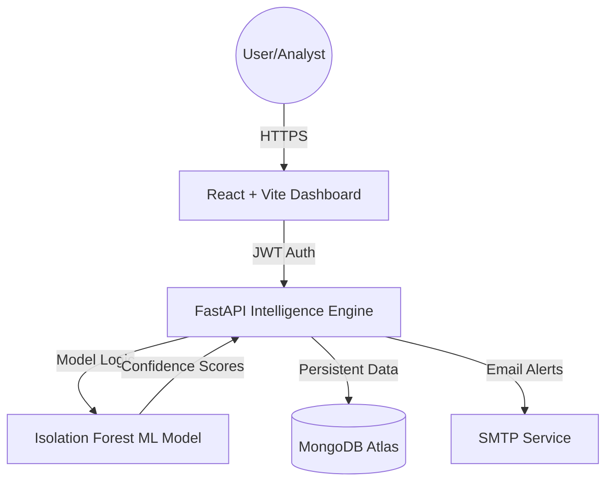

<div align="center">


# THREXIA
### AI-Powered Insider Threat Intelligence & Security Operations Center
*Detecting anomalous behavior before it becomes a breach.*

[](https://www.python.org/)
[](https://fastapi.tiangolo.com/)
[](https://www.mongodb.com/atlas)
[](https://react.dev/)
[](https://vercel.com/)

</div>

---

## 📌 Table of Contents

- [🔍 Overview](#-overview)
- [✨ Core Features](#-core-features)
- [🏗️ System Architecture](#-system-architecture)
- [🛠️ Tech Stack](#-tech-stack)
- [🤖 Machine Learning Core](#-machine-learning-core)
- [📁 Project Structure](#-project-structure)
- [🚀 Quick Start](#-quick-start)
- [🌐 Production Deployment](#-production-deployment)
- [👨‍💻 Team](#-team)

---

## 🔍 Overview

**THREXIA** is an end-to-end AI-powered threat intelligence platform built to detect insider threats and anomalous user behavior within organizational system logs. It combines unsupervised machine learning (Isolation Forest) with a high-fidelity, role-based security dashboard.

Unlike traditional rule-based systems, THREXIA uses behavioral biometrics to identify subtle deviations in employee activity—such as off-hours data access, unusual device usage, or increased document printing—flagging them as potential security risks before data exfiltration occurs.

---

## ✨ Core Features

| Feature | Description |
|---|---|
| 🛡️ **AI-Driven Detection** | Uses Isolation Forest ML models to flag anomalies with high confidence. |
| 💾 **Persistent Logging** | Integrated with **MongoDB Atlas** for permanent storage of telemetry and audit data. |
| 🕵️ **Analyst Command Center** | Real-time feed for Security Analysts to investigate, resolve, or escalate threats. |
| 📊 **Executive Intelligence** | High-level reporting for IT Managers with neutralization rates and integrity scores. |
| 🔐 **Advanced Security** | JWT-based session management, RBAC, and Bcrypt password hashing. |
| 🎨 **Futuristic UI** | Glassmorphic, responsive interface built for modern Security Operation Centers (SOC). |
| 🔄 **State Persistence** | Analyst actions (Resolve/Escalate) are saved to the database and persist across sessions. |

---

## 🏗️ System Architecture



---

## 🛠️ Tech Stack

### Backend & AI
- **FastAPI**: High-performance Python web framework.
- **Scikit-Learn**: Powering the Isolation Forest anomaly detection.
- **Joblib**: For serialized ML model serving.
- **MongoDB Atlas**: Cloud-native document storage for persistent telemetry.

### Frontend
- **React 19**: Modern component-based architecture.
- **Vite**: Next-generation frontend tooling.
- **Framer Motion**: Smooth, high-performance UI animations.
- **Lucide React**: Professional security iconography.

---

## 🤖 Machine Learning Core

THREXIA utilizes an **Isolation Forest** algorithm trained on the *Corporate Insider Threat Dataset*. 

- **Input Dimensions**: 14 features (e.g., printed_off_hours, usb_transfer, hostility_index).
- **Inference**: The model calculates an anomaly score for every system log.
- **Explainability**: The system interprets model outputs into human-readable warnings (e.g., "Abnormal off-hours data extraction detected").

---

## 📁 Project Structure

```bash
THREXIA/
---

## 🚀 Getting Started

### Prerequisites

- Python 3.9 or higher
- pip package manager
- A Kaggle account (for dataset download)

### 1. Clone the Repository

```bash
git clone https://github.com/Anasnaveed69/THREXIA.git
cd THREXIA
```

### 2. Install Dependencies

```bash
pip install pandas numpy scikit-learn matplotlib seaborn joblib imbalanced-learn kagglehub
```

Or install all at once:

```bash
pip install -r requirements.txt
```

### 3. Configure Kaggle API

```bash
# Place your kaggle.json credentials in:
~/.kaggle/kaggle.json

# Or authenticate via kagglehub in the notebook:
import kagglehub
kagglehub.login()
```

### 4. Running the Project

#### Start Backend
```bash
cd backend
# Create virtual environment (optional)
python -m venv venv
source venv/bin/activate # or venv\Scripts\activate on Windows
pip install -r requirements.txt
python main.py
```

#### Start Frontend
```bash
cd frontend
npm install
npm run dev
```

---

## 🌐 Deployment

The trained model artifacts are consumed by a **FastAPI** backend.

```python
# Example: Loading saved model for prediction in backend/main.py
import joblib

model  = joblib.load("models/threxia_model.joblib")
scaler = joblib.load("models/threxia_scaler.joblib")

# Prediction logic
scaled_input = scaler.transform(raw_features)
prediction = model.predict(scaled_input) # -1 = threat, 1 = normal
```

### Production Deployment (Northflank)

For a fast, always-on backend without cold starts, we recommend **Northflank**:

1.  **Create Service**: Select "Service" -> "Combined Service" on Northflank.
2.  **Source**: Connect your GitHub repository.
3.  **Build Settings**:
    *   **Build Type**: Dockerfile
    *   **Context**: `backend/`
    *   **Dockerfile Path**: `Dockerfile`
4.  **Environment Variables**: Add your `MONGO_URI`, `SECRET_KEY`, etc.
5.  **Networking**: Set port to `8000`.

**Planned future extensions:**
- Real-time log streaming via WebSockets
- Integration with live enterprise environments
- Advanced deep learning models (Autoencoders, LSTMs)
- SIEM/UEBA platform integration hooks

---

## 👨‍💻 Team

**BCS-6D | Department of Computer Science**
**FAST-NU, Lahore, Pakistan**

| Name | Roll Number |
|---|---|
| Anas Naveed Butt | 23L-0764 |
| Muhammad Usman Saboor | 23L-0813 |
| Ibrahim Rashid | 23L-0741 |
| Mohib Ali Khattak | 23L-0763 |

---

## 🙏 Acknowledgements

- **CERT Division, Carnegie Mellon University** — for the CERT Insider Threat Test Dataset
- **Ahmed Uzaki (Kaggle)** — for the Corporate Insider Threat Dataset
- **FAST-NU, Lahore** — Department of Computer Science, for academic guidance and support
- Course instructors for **Artificial Intelligence**, **Software Engineering**, and **Human-Computer Interaction**

---

<div align="center">

**THREXIA** — *Turning raw logs into actionable intelligence.*

Made with ❤️ at FAST-NU Lahore · 2025–2026

</div>
